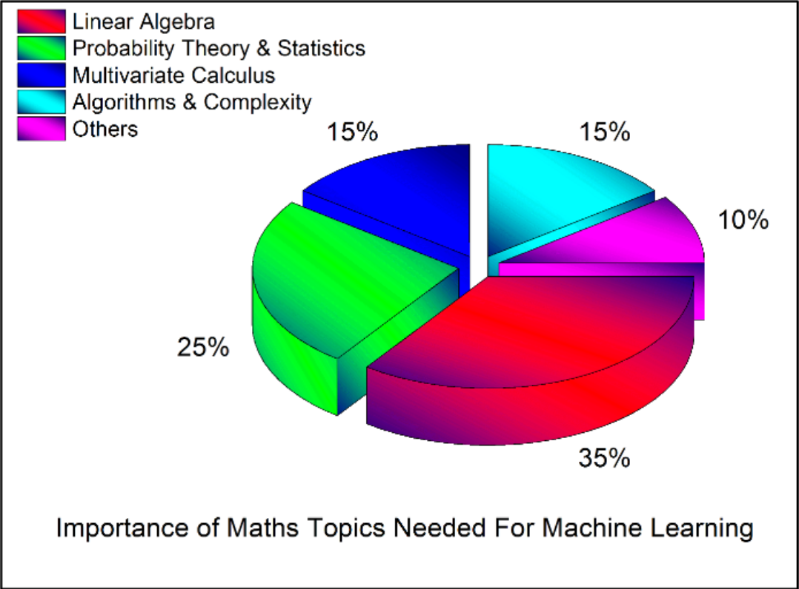

## 👋

Hi there! Welcome to the _Introduction to Linear Algebra Using Python_ guide. This guide will with the very basics and walk you through the fundamentals of linear algebra. As we go, we will implement the concepts we learn in Python to get a feel of how these concepts are used in real world. I'm happy you're here, and I hope you find this guide helpful. Let's get to it! 🚀

## Why linear algebra?
Throughout the years, there have been a tremendous number of advancements in helping us better understand the world. A key tool used in developing this understanding is that of a mathematical model. The usefulness of mathematics is not solely bound to math, but spills over into many other science, engineering, and social applications. Even more recently, with the interest in machine learning and artificial intelligence (AI), we are seeing applications of mathematical models in seemingly non-obvious domains (for example: [Magenta](https://magenta.tensorflow.org/), [AI generated artwork](https://www.nytimes.com/2018/10/22/arts/design/christies-art-artificial-intelligence-obvious.html), [archaeology](https://www.techrepublic.com/article/how-deep-learning-helps-archaeologists-rediscover-the-past/), to name a few). Oftentimes, the most useful and powerful models are developed using the concepts found in linear algebra, because models developed using linear algebra tend to describe the real world in a simple and understandable way.

As alluded to above, given the surge of interest in machine learning and AI over the past 10 years, it makes sense that linear algebra interest has grown as well, because linear algebra constitutes a large portion of the mathematical underpinnings of machine learning and AI. As demonstrated by the following pie chart, linear algebra constitutes approximately 35% of the underlying math used in machine learning:

(outputs/Introduction_attach_1_image.png)

<figcaption style="display: block; text-align:center;">(<a href="https://towardsdatascience.com/the-mathematics-of-machine-learning-894f046c568">image source</a>)</figcaption>

Whether or not this proportion is correct, one thing is certain: linear algebra is a fundamental part of machine learning. At the core of [linear algebra](https://en.wikipedia.org/wiki/Linear_algebra) are the concepts of linear equations, vectors, matrices, and linear transformations. It's okay if you don't know what any of these mean. We'll get to all this in due time.

## Motivating example
I tend to learn best by seeing examples after being introduced to a new concept in an attempt to draw intuition to the concept. As a result, these guides will contain lots of examples to help make connections between the concepts and intuition. Additionally, each concept will have a Python implementation to give you an idea of how they are used in practice. With that said, for the sake of continuity (and lack of imagination), most of the examples will center around contrived problems within a hypothetical business. Meet Harry's Hotdogs and Hamburgers:

(outputs/Introduction_attach_2_image.png)

<figcaption style="display: block; text-align:center;">(<a href="https://www.flickr.com/photos/sydneyhistory/6914445773/">image source</a>)</figcaption>

> Harry's Hotdogs and Hamburgers specializes in, well, hotdogs and hamburgers. Harry tends to set up shop at various events selling his world-famous hotdogs and hamburgers. Business has been good to Harry and as a result has allowed him to think about the future. Harry is thinking about expanding to new events and open new stands, but he wants to make sound financial decisions. Before making any decisions, Harry wants to make predictions about his future profit to ensure that the decision to expand is wise. He enlists our help to assist him in predicting his finances. He has agreed to give us a list of his sales and finances, and our goal will be to build a model for Harry to help predict how much he can expect to earn given his current sales.

This sounds like quite the responsibility, and you may not even know where to start, but that's okay. I think you're up to the challenge. There are lots of unknowns here, so we're going to work through each one and build up our knowledge brick-by-brick until we have the necessary tools to help Harry. Ultimately, we're working towards this goal of building a predictive model for Harry, but throughout this guide, we'll see other problems Harry may have that we can help with.

## Prerequisities
The goal is to provide a soft introduction to linear algebra. As a result, basic high-school math is really all you need. For the Python portion, basic working knowledge of Python should do. This won't serve as an introduction to Python as there are far better resources out there than I could provide. The Python code in this guide is written using Python 3, but _most_ examples should work with Python 2 as well, but your mileage may vary.

## Why am I doing this?
While there are more and more great resources available for linear algebra, historically, the resources have been either unnecessarily academic or abstract in nature. My intent with this guide is to provide an introduction to the concepts of linear algebra, and (hopefully) distill some of the unnecessarily complex topics down into something more consumable. I've tried to keep the theory down to a minimum where possible, at the expense of mathematical rigor. I certainly won't shy away from it where it's beneficial, but you won't see elaborate proofs of the concepts here. The main goal I'm seeking is to provide an intuitive bridge between concepts in linear algebra. Additionally, I'm going to demonstrate most concepts using Python to provide another layer of demonstration and applicability.

It's also important to call out that I'm not an expert, nor am I claiming to be. Another (selfish) goal of this guide is to help reinforce my own learning of linear algebra. Borrowing from Richard Feynman, I believe there is no better way to understand a topic than trying to teach it.

## How to read this
The guides are ordered in a way that should ultimately progress towards our goal of helping Harry. However, I've tried to keep the individual sections of the guides as self-contained as possible and where necessary, I've linked to other guides. This should allow you to skip to different concepts if that's more your style.

## Resources
I've based my own learning around a few pretty good resources, and you'll likely see influences in these guides. A few resources that I find quite good:

  - [OpenCourseWare - Linear Algebra (Strang)](https://ocw.mit.edu/courses/mathematics/18-06-linear-algebra-spring-2010/)
  - [Introduction to Linear Algebra](https://www.amazon.com/Introduction-Linear-Algebra-Gilbert-Strang/dp/0980232775/ref=sr_1_3?ie=UTF8&qid=1546402813&sr=8-3&keywords=introduction+to+linear+algebra)
  - [Linear Algebra and Its Applications (Strang)](https://www.amazon.com/Linear-Algebra-Its-Applications-4th/dp/0030105676/ref=sr_1_2?ie=UTF8&qid=1546402861&sr=8-2&keywords=linear+algebra+strang)
  - [Linear Algebra and Its Applications (Lay)](https://www.amazon.com/Linear-Algebra-Its-Applications-5th/dp/032198238X/ref=sr_1_4?ie=UTF8&qid=1546402914&sr=8-4&keywords=linear+algebra+textbook)
  - [Fast.ai - Computational Linear Algebra](https://www.fast.ai/2017/07/17/num-lin-alg/)

## Roadmap
1. Introduction (this guide)
2. [Vectors](vectors)
3. [Matrices](matrices)
4. [Linear Systems](linear-systems)
5. Solving Systems of Linear Equations
6. ...

## Feedback
I'm open to feedback, so please don't hesitate to reach out if there is something you think can be improved, expanded on, or is flat out wrong. Questions or errata can be sent to <bryan@bryan.blog>.

## Get Updates!

I'm currently in the process of writing and reviewing the other guides, so make sure you sign up below in order to be notified when I publish them. 
