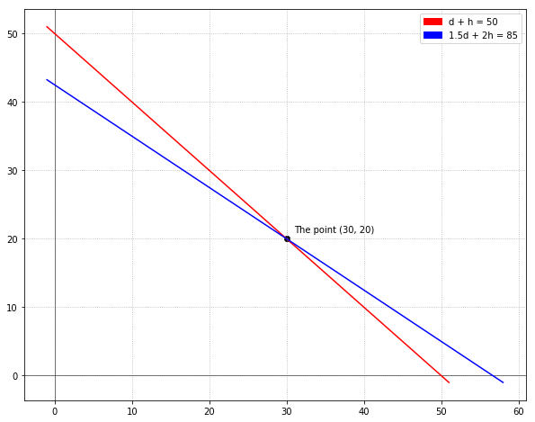

## Introduction
Now that we have a handle on [vectors](vectors) and [matrices](matrices), we're going to take our first foray into using what we've learned so far and apply it to a real problem. This problem will help drive some of the examples so that we can draw connections between the problem and the math used to solve the problem. Recall from the [introduction](introduction) guide we introduced _Harry's Hotdogs and Hamburgers_. Harry has enlisted our help to solve a problem of his:

> Harry recently set up shop at a baseball game. Things went well, but at the end of the day, Harry realizes that he didn't keep track of how many individual hotdogs and hamburgers he sold, but he does have totals. He knows that he sold of a combined total of 50 hotdogs and hamburgers and he made \\$85.00 total. Harry sells the hotdogs for \\$1.50 and the hamburgers for \\$2.00. In order to restock, Harry would like to know how many hotdogs and hamburgers he individually sold.

Okay, now that we understand the problem, let's see if we can write what we know in math terms. We know the total number of hotdogs and hamburgers sold was 50:

$$hotdogs + hamburgers = 50$$

And, selling the hotdogs for \\$1.50 and the hamburgers for \\$2.00 the total amount made was \\$85.00:

$$\$1.50 * hotdogs + \$2.00 * hamburgers = \$85.00$$

To make things easier to look at, we'll abbreviate the number of hotdogs as $d$ and hamburgers as $h$. We can specify our full problem as:

$$
d + h = 50 \\
1.5d + 2h = 85
$$

This is Harry's problem formalized into math terms. Since he wants to know the individual number of hotdogs and hamburgers sold, **our goal is to find the values of $d$ and $h$**.

What we just specified above is a system of linear equations. The name may sound intimidating, but you've most likely seen them at some point. We'll take each term in turn:

  - **system** - A collection of 2 or more things (in this case linear equations)
  - **linear equation** - For now, you can think of a linear equation as simply an equation that specifies a line. Formally, a linear equation is an equation that can be put into the form of $a_1x_1 + a_2x_2 + \ldots + a_nx_n + b = 0$.

The most common linear equation that we've all seen is:

$$y = mx + b$$

This is the equation of a line written in slope-intercept form. In this equation $m$ is the slope and $b$ is the y-intercept. While this may not look like a linear equation as we specified above, we can do a little arithmetic and rewrite the slope-intercept form in the style specified in the list above:

$$mx - y + b = 0$$

We just moved all the variables and constants to the left side. Additionally, we use $x$ and $y$ as the variables instead of $x_1$ and $x_2$. Regardless of the style, these equations specify a line in the X-Y plane that has a X-part and a Y-part. However, we're not just limited to lines in the X-Y plane. These equations can be extended to lines with any number of variables. For example, here is a 3D example using X, Y, and Z.

$$a_1x + a_2y + a_3z + b = 0$$

In these examples, the symbols in front of the variables (the variables are the $x$'s, $y$'s, $z$'s and $x_i$'s above) are called **coefficients** and they are just simple scalar numbers. In the case of Harry's equations above:

$$
d + h = 50 \\
1.5d + 2h = 85
$$

We chose $d$ and $h$ as the variable names. The coefficients in first equation are easy: $1$ for $d$ and $1$ for $h$ respectively, and for the second: $1.5$ for $d$ and $2$ for $h$.

You may have noticed that in some equations, I used $x$ and $y$ and in others I used $d$ and $h$. The actual variable that you use really isn't all that important; however, it is important that you're consistent in your usage when specifying a system.

## Simple linear equation

Using what we know so far about linear equations, let's look at one of the equations from Harry's system above:

$$d + h = 50$$

Sometimes, it's useful to visualize the linear equation geometrically and plot it in a coordinate system. We can easily rewrite this equation so that it is in slope-intercept form:

$$h = -d + 50$$

Referencing the original slope-intercept form, $y = mx + b$, you can see that we're essentially allowing $h$ to be $y$ and $d$ to be $x$. We have a coefficient of $1$ for $d$ and $1$ for $h$. Given our definition of a line, we can say that $-1$ is the slope and $50$ is the Y-intercept. In other words, the line crosses the Y-axis at $50$ and our line slants downwards, because for every increase in $d$, $h$ goes down.

To plot this line, we can take a few of values of $d$ and solve for $h$. The simplest value for $d$ is $0$. When $d = 0$, we have $h = 0 + 50$, and solving for $h$, we get $h = 50$. This is consistent with our intuition of the Y-intercept above (recall the definition of the Y-intercept is when $x = 0$). Taking a couple other values of $d$:

$$
\begin{array}{rr} \hline
d & 0 & 10 & -10 \\ \hline
h & 50 & 40 & 60 \\ \hline
\end{array}
$$

We can clearly see that by increasing $d$, the values of $h$ go down and vice versa. This means that the line is sloping downwards.

Now that we have some points, let's plot those and draw a line through them. Note that this line extends indefinitely in either direction.

It can be tough to reason about the intuition of the chart, but I'll give it a try. Since we are plotting the equation $d + h = 50$, this chart represents the combination of the total number of hotdogs and hamburgers, with the X and Y-axes being the number of hotdogs and hamburgers respectively. Recall the Y-intercept is when $d = x = 0$, so in our case, the Y-intercept is $50$. This is equivalent to saying that of the $50$ total hotdogs and hamburgers, 0 hotdogs and 50 hamburgers were sold. As you increase the number of hotdogs (i.e., move right along the X-axis), you can see the number of hamburgers comes down. It's a delicate balance because our constraint $d + h = 50$, so if $d$ increases, $h$ **must** decrease in order for the equation to hold true. You can increase this until you reach the X-intercept (where $h = y = 0$) and surprise, surprise, $d = 50, h = 0$, which can be interpreted as: of the $50$ total hotdogs and hamburgers, 50 hotdogs and 0 hamburgers were sold.

## System of linear equations

Now that we have a command over a single linear equation, let's revisit Harry's system of linear equations. Recall, a system is simply another word for a collection of linear equations.

$$
d + h = 50 \\
1.5d + 2h = 85
$$

Repeating above, $d + h = 50$ tells us that a total of 50 hotdogs and hamburgers were sold. $1.5d + 2h = 85$ tells us that when charging \\$1.50 for hotdogs and \\$2.00 for hamburgers, the stand earned a total of \\$85.00. Harry wants to know how many of each variety were sold. How do we find this out? There are few different ways: geometrically, substitution, and elimination.

Solving geometrically is the most intuitive, so let's start with that.

### Geometrically
Since our system above is just 2 linear equations, we can plot the independent lines and see the point at which they cross. The X-Y point at which they cross is the solution to the system! Below the red line is the equation $d + h = 50$ (same as above), and the blue line is the equation $1.5d + 2h = 85$. Let's see it in action.

Eureka! They cross at the point $x = d = 30$, $y = h = 20$. What this tells us is that of the 50 total hotdogs and hamburgers, Harry sold 30 hotdogs and 20 hamburgers. Although it may be obvious, we can plug these numbers back into our original equations to double check:

$$d + h = 50 \\ (30) + (20) = 50 \enspace \checkmark$$

With this newfound information, Harry can happily replenish his stocks knowing how many hotdogs and hamburgers he should buy.

Solving the system geometrically is an intuitive way to see the solution, but unfortunately, doesn't get us very far. First, we aren't able to reason about linear equations geometrically that contain more than 3 variables (i.e., we can't plot an equation that has 5 variables is 5D). Second, we can't write code to solve the equations. Fortunately, there are 2 other methods that are much more systematic.

### Substitution

Another way to solve for $d$ and $h$ is to solve one of the equations with respect to one of the variables and substitute that into the other equation. Given Harry's system:

$$
d + h = 50 \\
1.5d + 2h = 85
$$

The easiest route is to solve the first equation with respect to $d$ by moving $h$ to the other side:

$$d = 50 - h$$

Now, substitute this into the other equation for the variable $d$ and solve for $h$:

$$
1.5d + 2h = 85 \\
1.5(50 - h) + 2h = 85 \\
75 - 1.5h + 2h = 85 \\
0.5h = 10 \\
h = 20
$$

Now that we know the value of $h$, we can find the value of $d$ by substituting back into $d = 50 - h$:

$$d = 50 - (20) \\ d = 30$$

That leaves us with $d = 30$, $h = 20$ which is consistent with our geometric solution. Phew.

### Elimination

Finally, a third way we can solve the system of equations is by using elimination. To solve using elimination, we need to get rid of (i.e., _eliminate_) one of the variables and then solve for the remaining variable. With Harry's system again:

$$
d + h = 50 \\
1.5d + 2h = 85
$$

Although these 2 equations help describe the same problem, they are completely independent equations. As such, we're able to combine them in various ways without changing the true value of $d$ and $h$. We are able to perform the following operations to the equations:

  1. Multiply an equation by a scalar number
  2. Add the equations (or any multiple of the equations)
  3. Subtract the equations (or any multiple of the equations)

We have to be careful to ensure that whatever we do, we do it to both sides of the equation. What can we do to these equations to get them into a state such that we can "knock out" one of the variables? It would be pretty easy to get rid of $1.5d$ in the second equation by subtracting a multiple of the first equation from the second. Let's see it in action.

Multiply the first equation by $1.5$ leaving the second equation untouched:

$$
(1.5)d + (1.5)h = (1.5)50 \\
1.5d + 2h = 85
$$

Carrying the multiplication through, this leaves us with:

$$
1.5d + 1.5h = 75 \\
1.5d + 2h = 85
$$

Now, we can subtract the second equation from the first:

$$
1.5d + 1.5h = 75 \\
- (1.5d + 2h = 85)
$$

The $d$ term goes to zero and what we're left with is:

$$-0.5h = -10$$

Solving for $h$, we get $h = 20$. So far, we can see that is consistent with our geometric solution. To find the value for $d$, plug $h = 20$ back into one of the original equations and solve for $d$. For instance, we will plug $h$ back into the first equation:

$$
d + h = 50 \\
d + (20) = 50
$$

Solving for $d$, we get $d = 30$ which leaves us with:

$$d = 30, h = 20$$

Which is consistent with our geometric solution.

## Connection to vectors and matrices

I strategically put this guide after the guide on [matrices](matrices), because there is a connection between matrices and systems of linear equations. The connection is that you can represent the system of linear equations as a matrix! Recall Harry's system from above:

$$
d + h = 50 \\
1.5d + 2h = 85
$$

We can represent this system using matrices with a row per equation. First, let's create a matrix for the coefficients. There are 2 equations total and 2 variables per equation, so we have a $2 x 2$ matrix:

$$\begin{bmatrix}1 & 1 \\ 1.5 & 2\end{bmatrix}$$

The row of $1$'s represent the coefficients for $d$ and $h$ in the first equation. Same for the second row and the second equation.

Next, we'll represent the variables with a $2 x 1$ matrix/vector with 2 elements:

$$\begin{bmatrix}d \\ h\end{bmatrix}$$

Finally, we also represent the totals with a $2 x 1$matrix/vector with 2 elements:

$$\begin{bmatrix}50 \\ 85\end{bmatrix}$$

Now, we just need to put all the pieces together:

$$
\begin{bmatrix}1 & 1 \\ 1.5 & 2\end{bmatrix}
\begin{bmatrix}d \\ h\end{bmatrix}
=
\begin{bmatrix}50 \\ 85\end{bmatrix}
$$

What we've done is represented the system of linear equations as a product of 2 matrices. If you were to carry through the multiplication, you'd see that we arrive back at the same system:

$$
\begin{bmatrix}1d & 1h \\ 1.5d & 2h\end{bmatrix}
=
\begin{bmatrix}50 \\ 85\end{bmatrix}
$$

In general, a system of linear equations can be represented as the product of a coefficient matrix and a vector of unknown variables:

$$A\vec{x} = \vec{b}$$

Where $A$ is the matrix of coefficients, $\vec{x}$ is the vector of unknown variables, and $\vec{b}$ is the vector of constants to the right of the equals sign. What we'll be interested in is finding the values in $\vec{x}$ such that it satisfies the equation.

$$
\begin{bmatrix}1 & 1 \\ 1.5 & 2\end{bmatrix}
\begin{bmatrix}d \\ h\end{bmatrix}
=
\begin{bmatrix}50 \\ 85\end{bmatrix}
\\
\enspace A\quad\enspace\enspace\vec{x} \enspace=\enspace\enspace\vec{b}
$$

The benefit of representing systems of linear equations this way is that it allows us to do all kinds of interesting matrix operations on the system. But, how does this help Harry? Even though we've seen how to solve systems of linear equations, in the next section, we'll see how to solve for $\vec{x}$ using matrix operations.

## Solvability

We saw above that the solution to a system of linear equations is the point at which the linear equations intersect. However, in practice sometimes the equations may not cross or may cross many times. In later guides, we'll dig into these corner cases and talk about what this means for our potential solutions and how to handle them.

## Summary
We saw a concrete example of how solving a system of linear equations is useful by helping our friend Harry answer a question about how many hotdogs and hamburgers he should buy to restock. While our problem may have seemed trivial, many problems in all kinds of domains can be structured as a system of linear equations. Like most things in math, there are multiple ways to solve a single problem and solving systems of linear equations is no exception. We saw that, for small enough examples, the problem can be solved geometrically by plotting the equations and seeing where they cross. Alternatively, we can solve the equations by substitution by taking one of the equations, solving for one of the variables, and substituting it back into the other equation and solving. Finally, the we can solve by elimination by combining the equations in ways to systematically eliminate the variables until we're left with only one. We can then solve for the others by plugging in the known values.

## tl;dr

- Systems of linear equations are just a collection of equations that are linear in nature
- System == collection
- Linear equations == equations that can be put in the form: $a_1x_1 + a_2x_2 + \ldots + a_nx_n + b = 0$
- $y = mx + b$ is a common linear equation with 2 variables ($x$ and $y$)
- Systems can be solved geometrically by plotting the equations and seeing at what point they cross
- Systems can be solved using substitution by taking one of the equations, solving for a variable, substitute back into the other equation, and solve
- Systems can be solved using elimination by combining the equations in order to eliminate the variables one-by-one until you're left with one and then plugging back in the known value
- During elimination, equations can be multiplied by a scalar, added, or subtracted
- Systems of linear equations can be represented as matrices by putting the coefficients in a matrix, and the variables and constants into a vector: $A\vec{x} = \vec{b}$

## What's next?

This guide introduced the idea behind systems of linear equations and showed various ways to arrive at a solution. However, no code was given for how we might systematically solve a system. As systems grow in the number of variables and equations, it becomes increasingly important to solve the systems in a systematic way. In the [next section](solving-systems-of-linear-equations), we'll determine how we can use matrices to represent and solve Harry's system of linear equations, and see how we can write some code to automatically solve systems of linear equations.

<nav class="links">
    <a href="matrices" class="prev">Matrices</a>
    <a href="solving-systems-of-linear-equations" class="next">Solving Systems of Linear Equations</a>
</nav>
