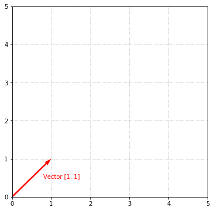

## Introduction

In the [vectors](vectors) guide, we were introduced to the concept of vectors—one of the primitives of linear algebra. Another equally important primitive is that of matrices. Matrices are used everywhere in linear algebra and other areas of mathematics. Just like the word _vector_ sounds complex (but is nothing more than a list of numbers), a **matrix** is simply a _table_ of numbers that represents something. In fact, matrices and vectors really aren't all that different. This is an example of what a matrix looks like:

$$\begin{bmatrix}1 & 2 \\ 3 & 4\end{bmatrix}$$

Pretty simple. Looks a lot like a vector. Viewing matrices as tables, we say a matrix has columns and rows. A _column_ in a matrix is a vertical list of numbers (e.g., $\begin{bmatrix}1 \\\ 3\end{bmatrix}$ is the first column in the matrix above). A _row_ in a matrix is a horizontal list of numbers (e.g., $\begin{bmatrix}3 & 4\end{bmatrix}$ is the second row in the matrix above). 

Recall that we represented vectors as symbols with an arrow over it (e.g., $\vec{a}$). Matrices are usually represented with capital letters:

$$A = \begin{bmatrix}1 & 2 \\ 3 & 4\end{bmatrix}$$

Or, sometimes bolded:

$$\textbf{A} = \begin{bmatrix}1 & 2 \\ 3 & 4\end{bmatrix}$$

While the importance of vectors cannot be minimized, I tend to view vectors as something akin to syntactic sugar. What I mean by that is vectors and matrices look _awfully_ similar, don't you think? One might even say that vectors are a specialized type of matrix (a matrix with only a single column). We'll see more of that in a few minutes.

Matrices are an integral part of linear algebra and many other areas and disciplines. For example, here are just a few use cases for using matrices:

  - Represent the pixels in an image
  - Represent the responses to a user survey as the rows in a matrix
  - Represent the 3D transformation to move the camera in a video game
  - Calculate the properties of an electrical circuit

## All sizes and shapes
Matrices can come in all sizes and shapes. When describing a matrix, the size (or sometimes called shape) is important. Conventionally, the size is defined as $M x N$ where $M=\\#\ rows$ and $N=\\#\ columns$. Taking the following matrix:

$$A = \begin{bmatrix}1 & 2 \\ 3 & 4\end{bmatrix}$$

$A$ is a $2 x 2$ matrix (2 rows, 2 columns).

$$B = \begin{bmatrix}1 & 2 & 3\\ 4 & 5 & 6\end{bmatrix}$$

$B$ Is a $2 x 3$ matrix.

$$C = \begin{bmatrix}1 \\ 2 \\ 3\end{bmatrix}$$

$C$ is a $3 x 1$ matrix.

What a minute, isn't $C$ a vector? Yes, indeed. A vector is simply a $N x 1$ matrix where $N$ is the number of components. If a vector is just a special type of matrix, logic would dictate that any operation you can do to a vector, you can do to a matrix. And, that logic would be correct.

## Referencing elements
Often, it's useful to reference specific elements in a matrix. For example, if we wanted to reference $-1$ in the following matrix:

$$A = \begin{bmatrix}1 & 3 \\ \textbf{-1} & 2\end{bmatrix}$$

We see that $-1$ lives in the second row and first column. We represent this symbolically as $A_{i,j}$ where $i$ is the row number and $j$ is the column number. Since $-1$ lives in row 2 and column 1, we can represent this as:

$$A_{2,1} = -1$$

Likewise for all the elements:

$$
A_{1,1} = 1 \\
A_{1,2} = 3 \\
A_{2,1} = -1 \\
A_{2,2} = 2
$$

Awesome, let's pause and write some code to see how we can represent a matrix, determine its size, and fetch an element.


```python
# Represent a matrix as a list of lists
A = [[1, 3], [-1, 2]]

def size(matrix):
    """Gets the size of the matrix. Returns a tuple of the form (M, N) representing MxN where M is the number of
    rows and N is the number of columns.
    """
    # Number of rows
    M = len(matrix)
    # Number of columns
    N = len(matrix[0]) if M > 0 else 0
    return (M, N)

def el(matrix, i, j):
    """Returns the element located at position i,j of the matrix. Note, i and j are zero-based."""
    return matrix[i][j]

print('Size of A = %s' % (size(A),))
print('Element at A_1,1 = %d' % (el(A, 0, 0)))
print('Element at A_1,2 = %d' % (el(A, 0, 1)))
print('Element at A_2,1 = %d' % (el(A, 1, 0)))
print('Element at A_2,2 = %d' % (el(A, 1, 1)))
```


    Size of A = (2, 2)
    Element at A_1,1 = 1
    Element at A_1,2 = 3
    Element at A_2,1 = -1
    Element at A_2,2 = 2


Because a matrix is simply a table of numbers, the easiest way to represent a matrix in Python is as a list of lists. Note also, since Python is 0-based, the first element in the matrix is at position $(0, 0)$, whereas in our discussion, we were representing the first element as $(1, 1)$.

## Operating on matrices

In the previous section, we arrived at the conclusion that vectors are essentially special case matrices. Because of that, vector and matrix operations behave the same way. In order to avoid repetition, you can visit the [vectors](vectors) guide to see more details on how to perform vector operations. For the sake of completeness, I'll briefly walk through a few examples of matrix operations.

### Addition

Like vectors, addition of 2 matrices is done component wise:

$$
A = \begin{bmatrix}1 & 2 \\ 3 & 4\end{bmatrix}, B = \begin{bmatrix}5 & 6 \\ 7 & 8\end{bmatrix} \\[15pt]
A + B = \begin{bmatrix}1 & 2 \\ 3 & 4\end{bmatrix} + \begin{bmatrix}5 & 6 \\ 7 & 8\end{bmatrix} = \begin{bmatrix}(1 + 5) & (2 + 6) \\ (3 + 7) & (4 + 8)\end{bmatrix} = \begin{bmatrix}6 & 8 \\ 10 & 12\end{bmatrix}
$$

Like vectors, operations between 2 matrices require that the matrices be the same size. Above, $A$ and $B$ are both $2 x 2$.

### Subtraction

Similar for subtraction:

$$
A = \begin{bmatrix}1 & 2 \\ 3 & 4\end{bmatrix}, B = \begin{bmatrix}5 & 6 \\ 7 & 8\end{bmatrix} \\[15pt]
A - B = \begin{bmatrix}1 & 2 \\ 3 & 4\end{bmatrix} - \begin{bmatrix}5 & 6 \\ 7 & 8\end{bmatrix} = \begin{bmatrix}(1 - 5) & (2 - 6) \\ (3 - 7) & (4 - 8)\end{bmatrix} = \begin{bmatrix}-4 & -4 \\ -4 & -4\end{bmatrix}
$$

### Scalar multiplication

Similar for scalar multiplication:

$$
3 * \begin{bmatrix}1 & 2 \\ 3 & 4\end{bmatrix} = \begin{bmatrix}(3 * 1) & (3 * 2) \\ (3 * 3) & (3 * 4)\end{bmatrix} = \begin{bmatrix}3 & 6 \\ 9 & 12\end{bmatrix}
$$

## Rectangular and square matrices

The matrices shown above have all had the same number of rows and columns (e.g., $2 x 2$). These are called **square** matrices. Square matrices have a size of $N x N$ where $N$ is the number of rows and columns. However, matrices can have any number of rows and columns. A matrix that contains a different number of rows and columns is said to be a **rectangular** matrix. Rectangular matrices are usually referenced as $M x N$ where $M$ is the number of rows and $N$ is the number of columns. Fortunately, the matrix operations above work with matrices of any size (whether they are square or rectangular). For example, here is addition of two arbitrary $2 x 4$ matrices:

$$
\begin{bmatrix}1 & 2 & 3 & 4 \\ 5 & 6 & 7 & 8\end{bmatrix} + \begin{bmatrix}1 & 3 & 5 & 7 \\ 2 & 4 & 6 & 8\end{bmatrix} = \begin{bmatrix}2 & 5 & 8 & 11 \\ 7 & 10 & 13 & 16\end{bmatrix}
$$

When adding and subtracting matrices, the matrices **must** be the same size.

## Multiplying matrices

With all the operations we've talked about so far, there's been one glaring omission—direct multiplication of matrices and vectors. The process of matrix multiplication is a little more involved, but knowing how to multiply matrices will be incredibly important. Just as multiplying two scalar numbers results in a third scalar number, multiplying two matrices results in a third matrix.

We represent matrix multiplication by putting two matrices side by side like normal scalar multiplication:

$$\begin{bmatrix}1 & 0 \\ 2 & 3\end{bmatrix}\begin{bmatrix}2 & 3 \\ 1 & 1\end{bmatrix} = \enspace ?$$

There are a couple of different ways to perform matrix multiplication, but either way, we arrive at the same result. We'll walk through each in detail below.

### Element-by-element
One way to multiply two matrices is in an element-wise fashion. To compute the elements in the resulting matrix, we take the **rows** of the left matrix and **columns** of the right matrix and for each row/column, sum up the product of each component in the row and column. Sounds more complicated than it is. Let's walk through an example. Given the following 2 matrices:

$$A = \begin{bmatrix}1 & 0 \\ 2 & 3\end{bmatrix}, B = \begin{bmatrix}2 & 3 \\ 1 & 1\end{bmatrix}$$

We want to find the the matrix $C$ which is the result of multiplying $A$ and $B$:

$$AB = C$$

We start by finding $C_{1,1}$ by taking the first row of the left matrix ($A$) and the first column of the right matrix ($B$):

$$\begin{bmatrix}1 & 0 \\ & \end{bmatrix}\begin{bmatrix}2 & \\ 1 & \end{bmatrix} = \begin{bmatrix} C_{1,1} & \\ & \end{bmatrix}$$

And, for each component, multiply them together and take the sum of all the products:

$$
C_{1,1} = (A_{1,1} * B_{1,1}) + (A_{1,2} * B_{2,1}) = (1 * 2) + (0 * 1) = 2 \\[5pt]
\begin{bmatrix}1 & 0 \\ & \end{bmatrix}
\begin{bmatrix}2 & \\ 1 & \end{bmatrix} = 
\begin{bmatrix}(1 * 2) + (0 * 1) = 2 &  \\  & \end{bmatrix}
$$

This result lives in $C_{1,1}$ because we took the first row of $A$ ($i = 1$) and first column of $B$ ($j = 1$):

$$\begin{bmatrix}1 & 0 \\ & \end{bmatrix}\begin{bmatrix}2 & \\ 1 & \end{bmatrix} = 
\begin{bmatrix}2 &  \\  & \end{bmatrix}$$

Next, we move on to $C_{1,2}$ (the first row of $A$ and second column of $B$):

$$
\begin{bmatrix}1 & 0 \\ & \end{bmatrix}
\begin{bmatrix} & 3 \\ & 1\end{bmatrix}
=
\begin{bmatrix}2 & C_{1,2} \\ & \end{bmatrix}
$$

Multiplying and summing again, and we have:

$$\begin{bmatrix}1 & 0 \\ & \end{bmatrix}\begin{bmatrix} & 3 \\ & 1\end{bmatrix} = 
\begin{bmatrix}2 & (1 * 3) + (0 * 1) = 3 \\  & \end{bmatrix}$$

This result lives in $C_{1,2}$ because we took first row of $A$ ($i = 1$) and the second column of $B$ ($j = 2$):

$$\begin{bmatrix}1 & 2 \\ & \end{bmatrix}\begin{bmatrix} & 3 \\ & 1\end{bmatrix} = 
\begin{bmatrix}2 & 3 \\  & \end{bmatrix}$$

This process continues for the third and fourth elements ($C_{2,1}$ and $C_{2,2}$):

$$
\begin{bmatrix}
  1 & 0
   \\
  2 & 3
\end{bmatrix}
\begin{bmatrix}
  2 & 3
   \\
  1 & 1
\end{bmatrix}
= 
\begin{bmatrix}
  2 & 3
     \\
  (2 * 2) + (3 * 1) = 7 & (2 * 3) + (3 * 1) = 9
\end{bmatrix}
$$

until we arrive at:

$$
\begin{bmatrix}1 & 0 \\ 2 & 3\end{bmatrix}\begin{bmatrix}2 & 3 \\ 1 & 1\end{bmatrix} = 
\begin{bmatrix}2 & 3 \\ 7 & 9\end{bmatrix}$$

Generically, if we are describing the multiplication:

$$AB = C$$

We can find the element in the $i$th row and $j$th column of $C$ with:

$$C_{i,j} = \sum_{n=1}^{N} A_{i,n}B_{n,j}$$

This can be interpreted as: take the $i$th row of $A$ and the $j$th column of $B$ and take the following sum:

$$C_{i,j} = A_{i,1}*B_{1,j} + A_{i,2}*B_{2,j} + \ldots + A_{i,N}*B_{N,j}$$

Where $N$ is the number of rows/columns.

### Combination of columns
Okay, phew. I know that's a lot to take in. If you stopped now, you'd officially know how to multiply matrices, but unfortunately, the element-wise approach isn't very intuitive. It _is_ easy to implement though, so when we implement matrix multiplication, that's the approach we'll use. An alternate (and hopefully more intuitive) way to view matrix multiplication is as a combination of the columns of $A$. What does this mean?

We mentioned above that matrices are composed of columns and rows. One way to view a matrix is as a list of vectors stacked side-by-side:

$$
\begin{bmatrix}1 & 0 \\ 2 & 3\end{bmatrix}
\rightarrow
\begin{bmatrix}\begin{bmatrix}1 \\ 2\end{bmatrix}\begin{bmatrix}0 \\ 3\end{bmatrix}\end{bmatrix}
$$

When we're thinking about matrix multiplication as a combination of columns, $AB = C$, each column in $B$ is combining the columns of $A$ to produce a column in the result $C$. Once again, we want to find the result of multiplying $A$ and $B$ to produce $C$:

$$
A = \begin{bmatrix}1 & 0 \\ 2 & 3\end{bmatrix}, B = \begin{bmatrix}2 & 3 \\ 1 & 1\end{bmatrix}
\enspace\rightarrow\enspace
AB = C
$$

Using the column-based approach, each column in $B$ tell us how to combine the columns of $A$ to produce the columns in $C$. To start, let's take the first column of $B$ and use that to combine the columns of $A$.

$$\begin{bmatrix}1 & 0\\ 2 & 3\end{bmatrix}\begin{bmatrix}2 & \\ 1 & \end{bmatrix}$$

Each component $c_i$ in $\begin{bmatrix}2 \\\ 1\end{bmatrix}$ multiplies column $i$ in $A$. We then add up all of the "multiplied" columns to get the first column of the result. In other words, the first column in $C$ is a linear combination of the columns of $A$ and the components in $\begin{bmatrix}2 \\\ 1\end{bmatrix}$. In the above example, this is saying that we take $2$ of the first column and add it to $1$ of the second column to get the first column of $C$:

$$
2 * \begin{bmatrix}1 \\ 2\end{bmatrix} + 1 * \begin{bmatrix}0 \\ 3\end{bmatrix} = 
\begin{bmatrix}2 \\ 4\end{bmatrix} + \begin{bmatrix}0 \\ 3\end{bmatrix} = \begin{bmatrix}2 \\ 7\end{bmatrix}
$$

This result becomes the first column of $C$:

$$
\begin{bmatrix}1 & 0 \\ 2 & 3\end{bmatrix}
\begin{bmatrix}2 & \\ 1 & \end{bmatrix} = 
\begin{bmatrix}2 & \\ 7 & \end{bmatrix}
$$

Awesome. To get the second column of $C$, take the second column of $B$ and once again use it to combine the columns of $A$:

$$\begin{bmatrix}1 & 0\\ 2 & 3\end{bmatrix}\begin{bmatrix} & 3 \\ & 1\end{bmatrix}$$

$$
3 * \begin{bmatrix}1 \\ 2\end{bmatrix} + 1 * \begin{bmatrix}0 \\ 3\end{bmatrix} =
\begin{bmatrix}3 \\ 6\end{bmatrix} + \begin{bmatrix}0 \\ 3\end{bmatrix} = \begin{bmatrix}3 \\ 9\end{bmatrix}
$$

This resultant vector is the second column of $C$:

$$
\begin{bmatrix}1 & 0\\ 2 & 3\end{bmatrix}
\begin{bmatrix} & 3\\ & 1\end{bmatrix} = 
\begin{bmatrix} & 3\\ & 9\end{bmatrix}
$$

We've now found both columns of $C$:

$$
\begin{bmatrix}1 & 0 \\ 2 & 3\end{bmatrix}
\begin{bmatrix}2 & 3 \\ 1 & 1\end{bmatrix} = 
\begin{bmatrix}2 & 3 \\ 7 & 9\end{bmatrix}
$$

And, what do you know—$C$ is the same as our result from the element-wise multiplication above. Intuitively, the columns in $C$ are a linear combination of the columns of $A$ and it's the values in $B$ that dictate what those combinations are.

## Multiplying different sized matrices

Recall that when doing matrix addition and subtraction, the matrices **must** be the same size (i.e., both must be $MxN$). So far, the examples of matrix multiplication we've seen have all been with matrices of the same size. However, with multiplication, we're able to multiply different sized matrices. The only requirement is that the number of columns in $A$ must match the number of rows in $B$. That is, a matrix with size $M x N$ can be multiplied to another matrix of size $N x P$. The size of the resulting matrix will be $M x P$. Intuitively, since the columns in $B$ dictate the combination of the columns of $A$, it makes sense that the number of rows in the result matrix will equal the number of rows in $A$ and the number of columns of the result matrix will equal the number of columns in $B$. There's a useful mental image that you can use when determining if the multiplication is legal and what the result matrix's size will be:

<span style="display: none">(outputs/Matrices_attach_9_image.png)</span>

<figcaption style="display: block; text-align:center;">(<a href="http://www.coolmath.com/algebra/24-matrices/04-multiplying-matrices-01">image source</a>)</figcaption>

Multiplication of 2 different sized matrices still follows the same rules:

$$
\begin{bmatrix}1 & 2 & 3 \\ 2 & 1 & -1\end{bmatrix}\begin{bmatrix}0 & 1 \\ 2 & 1 \\ 3 & 2\end{bmatrix} \\[5pt]
\enspace A \qquad\qquad B
$$

The size of $A$ is $2 x 3$ and the size of $B$ is $3 x 2$. Since the number of columns in $A$ and number of rows in $B$ are the same, we're able to do the multiplication. The result is going to be a $2 x 2$ matrix.

$$
\begin{bmatrix}1 & 2 & 3 \\ 2 & 1 & -1\end{bmatrix}
\begin{bmatrix}0 & 1 \\ 2 & 1 \\ 3 & 2\end{bmatrix}
=
\begin{bmatrix}13 & 9 \\ -1 & 1\end{bmatrix} \\[5pt]
\quad\quad 2 x 3 \enspace\quad\quad 3 x 2 \quad\quad\enspace\enspace2 x 2\enspace\enspace
$$

Matrix multiplication with different sized matrices works exactly the same way as it does with matrices of the same size. Let's see what happens when we try to perform an invalid multiplication:

$$
Invalid \\[5pt]
\begin{bmatrix}1 & 2 \\ 2 & 1\end{bmatrix}
\begin{bmatrix}0 & 1 \\ 2 & 1 \\ 3 & 2\end{bmatrix}
= ☹
$$

If we were doing the multiplication element wise, we'd take the first row of $A$ and the first column of $B$ and try to multiply all the components together and then add them up. However, you'll immediately see that in the first row of $A$ there are 2 components while there are 3 components in the first column of $B$. We "ran out of" components in the first row of $A$. So, this multiplication is invalid.

What happens when we multiply a matrix and a vector? We caught of glimpse of it above when talking about combination of columns:

$$
\begin{bmatrix}1 & 2 \\ 3 & 4\end{bmatrix}
\begin{bmatrix}2 \\ 1\end{bmatrix}
=
\begin{bmatrix}? \\ ?\end{bmatrix}
\\
\enspace\enspace2 x 2 \quad 2 x 1 \enspace\enspace\enspace 2 x 1
$$

Since the matrix on the left is $2 x 2$ and the matrix on the right is $2 x 1$, the resulting matrix has the same number of rows as the left matrix and same number of columns as the right matrix: $2 x 1$, a vector. In general, any time a matrix is multiplied by a vector, the result is a vector:

$$
\begin{bmatrix}1 & 2 \\ 3 & 4\end{bmatrix}
\begin{bmatrix}2 \\ 1\end{bmatrix}
=
\begin{bmatrix}4 \\ 10\end{bmatrix}
$$

Okay, now that we understand all the rules behind how to multiply 2 matrices, we can write some code to do it! As mentioned above, the easiest way to implement matrix multiplication is the element-by-element approach.


```python
A = [[1, 2], [3, 4]]
B = [[2, 1], [1, 3]]

def size(matrix):
    """Gets the size of the matrix. Returns a tuple of the form (M, N) representing MxN where M is the number of
    rows and N is the number of columns.
    """
    M = len(matrix)
    N = len(matrix[0]) if M > 0 else 0
    return (M, N)


def multiply(matrix1, matrix2):
    """Multiplies 2 matrices. Returns a new matrix representing the multiplication of matrix1 and matrix2.
    """
    (M1, N1), (M2, N2) = size(matrix1), size(matrix2)
    # Ensure that this matrix multiplication is legal
    if N1 != M2:
        raise ValueError('Illegal matrix sizes. Unable to multiply %d x %d and %d x %d matrices.' % (M1, N1, M2, N2))

    # Create a result matrix that is M1 x N2 in size
    result = [[0 for i in range(N2)] for i in range(M1)]

    # Multiply the rows of matrix1 and columns of matrix2
    for row in range(M1):
        for col in range(N2):
            # Total represents C[row][col] which is calculated using A[row] and B[column]
            total = 0
            for e in range(N1):
                total += matrix1[row][e] * matrix2[e][col]
            result[row][col] = total

    return result

C = multiply(A, B)  # > [[4, 7], [10, 15]]
print('A * B = ', C)
```


    A * B =  [[4, 7], [10, 15]]


We start by getting the sizes of the 2 matrices and verifying that the multiplication is legal based on the sizes. Next, we create a new matrix to hold the result of the multiplication. Finally, we iterate over the rows of $A$ and the columns of $B$ to produce the elements of $C$. We start by finding $C_{1,1}$, then $C_{1,2}$ and so on.

## Visualizing matrices
Since we already know how to visualize vectors, visualizing a matrix is simply visualizing a list of vectors. With this in mind, let's visualize the following matrix:

$$\begin{bmatrix}1 & 3 \\ 3 & 2\end{bmatrix}$$

If we treat the columns as vectors, we're visualizing the 2 vectors: $\begin{bmatrix}1 \\\ 3\end{bmatrix}$ and $\begin{bmatrix}3 \\\ 2\end{bmatrix}$


### Visualizing matrix multiplication

An intuitive way to visualize matrix multiplication is by viewing it as a _transformation_. What this means is that an original matrix can be multiplied by some kind of "transformation" matrix that _transforms_ the original matrix into a new matrix. This will become clearer with an example. Let's take the matrix from above:

$$\begin{bmatrix}1 & 3 \\ 3 & 2\end{bmatrix}$$

And, let's say that we want to "flatten" the vectors onto the X-axis. That is, we want to draw a straight line from the red and blue vectors down to the X-axis. Right now, the vectors have an X-component and a Y-component, but we want to "flatten" them such that they just run along the X-axis. To get an idea of what we're after, the 2 magenta vectors are the flattened red and blue vectors:





The question is, what can we multiply the original matrix by to "transform" it into a new matrix that has these two vectors? We have the original matrix:

$$\begin{bmatrix}1 & 3 \\ 3 & 2\end{bmatrix}$$

And, we want to "flatten" it by transforming it into the following matrix:

$$\begin{bmatrix}1 & 3 \\ 0 & 0\end{bmatrix}$$

To do that, we're going to multiply our original matrix by another matrix to produce the "flattened" matrix:

$$
\begin{bmatrix}? & ? \\ ? & ?\end{bmatrix}\begin{bmatrix}1 & 3 \\ 3 & 2\end{bmatrix} = \begin{bmatrix}1 & 3 \\ 0 & 0\end{bmatrix}
$$

What does this transformation matrix look like?

$$
\begin{bmatrix}1 & 0 \\ 0 & 0\end{bmatrix}\begin{bmatrix}1 & 3 \\ 3 & 2\end{bmatrix} = \begin{bmatrix}1 & 3 \\ 0 & 0\end{bmatrix}
$$

You can see that by multiplying the original matrix by:

$$\begin{bmatrix}1 & 0 \\ 0 & 0\end{bmatrix}$$

It kept the X-axis portion of the original matrix, but "chopped" off the Y-axis portion, effectively flattening the vectors onto the X-axis. This results in the following:


## Order matters

When doing scalar multiplication, we're accustomed to order being irrelevant. We call this order-irrelevance the commutative property:

$$3 * 2 = 2 * 3 = 6$$

This property **does not** hold for matrices. Order is very important when multipliying matrices:

$$AB \neq BA$$

To demonstrate this, let's take an example from above:

$$
AB = C
\\[10pt]
\begin{bmatrix}1 & 2 & 3 \\ 2 & 1 & -1\end{bmatrix}
\begin{bmatrix}0 & 1 \\ 2 & 1 \\ 3 & 2\end{bmatrix}
=
\begin{bmatrix}13 & 9 \\ -1 & 1\end{bmatrix}
$$

We get a $2 x 2$ result. If we switch around the matrices so that we are multiplying $BA$:

$$
BA = D
\\[10pt]
\begin{bmatrix}0 & 1 \\ 2 & 1 \\ 3 & 2\end{bmatrix}
\begin{bmatrix}1 & 2 & 3 \\ 2 & 1 & -1\end{bmatrix}
=
\begin{bmatrix}2 & 1 & -1 \\ 4 & 5 & 5 \\ 7 & 8 & 7\end{bmatrix}
$$

We get a result that is $3 x 3$. The multiplication is still legal because we are multiplying $3 x 2$ and $2 x 3$ matrices. We can easily see that the matrices in either results are totally different. Order is critical. The reasoning behind this should be intuitive when you think about it from a column perspective. In $AB$, we are using $B$ to combine the columns of $A$. In $BA$, we are using the columns of $A$ to combine the columns of $B$. Totally different combinations.

### Combination of rows
We showed above that multiplying a matrix $A$ and a matrix $B$, the columns in $B$ are effectively combining the columns in $A$ to produce the columns in a matrix $C$:

$$
\qquad\qquad column\ 1 \qquad\qquad\qquad column\ 2 \\[5pt]
\begin{bmatrix}1 & 0 \\ 2 & 3\end{bmatrix}
\begin{bmatrix}2 & 3 \\ 1 & 1\end{bmatrix} =
\begin{bmatrix}
2 * \begin{bmatrix}1 \\ 2\end{bmatrix} + 1 * \begin{bmatrix}0 \\ 3\end{bmatrix}
& \enspace\enspace
3 * \begin{bmatrix}1 \\ 2\end{bmatrix} + 1 * \begin{bmatrix}0 \\ 3\end{bmatrix}
\end{bmatrix} =
\begin{bmatrix}2 & 3 \\ 7 & 9\end{bmatrix}
$$

However, there is an alternative way to view matrix multiplication. An alternative way to view matrix multiplication is as a combination of the rows of $B$. That is, by multiplying $A$ and $B$, we are using the rows of $A$ to combine the rows of $B$ to produce the rows in $C$. Let's see an example. First, we take the first row of $A$ and use that to combine the rows of $B$ to produce the first row in $C$:

$$
\begin{bmatrix}1 & 0 \\ &\end{bmatrix}
\begin{bmatrix}2 & 3 \\ 1 & 1\end{bmatrix} =
1 * \begin{bmatrix}2 & 3\end{bmatrix} + 0 * \begin{bmatrix}1 & 1\end{bmatrix} = 
\begin{bmatrix}2 & 3 \\ &\end{bmatrix}
$$

Same for the second row of $A$:

$$
\begin{bmatrix}& \\ 2 & 3\end{bmatrix}
\begin{bmatrix}2 & 3 \\ 1 & 1\end{bmatrix} =
2 * \begin{bmatrix}2 & 3\end{bmatrix} + 3 * \begin{bmatrix}1 & 1\end{bmatrix} = 
\begin{bmatrix}& \\ 7 & 9\end{bmatrix}
$$

Arriving at the following result:

$$
\begin{bmatrix}1 & 0 \\ 2 & 3\end{bmatrix}
\begin{bmatrix}2 & 3 \\ 1 & 1\end{bmatrix} =
\begin{bmatrix}2 & 3 \\ 7 & 9\end{bmatrix}
$$

Ultimately results in the same thing, but different interpretations. These different interpretations aren't intended to confuse you, it's simply to demonstrate that the rows and columns are intimately connected with the rows and columns of the matrices being multiplied.

## Putting all the code together


```python
# Represent a matrix as a list of lists
A = [[1, 3], [-1, 2]]

def size(matrix):
    """Gets the size of the matrix. Returns a tuple of the form (M, N) representing MxN where M is the number of
    rows and N is the number of columns.
    """
    # Number of rows
    M = len(matrix)
    # Number of columns
    N = len(matrix[0]) if M > 0 else 0
    return (M, N)

def el(matrix, i, j):
    """Returns the element located at position i,j of the matrix. Note, i and j are zero-based."""
    return matrix[i][j]

def multiply(matrix1, matrix2):
    """Multiplies 2 matrices. Returns a new matrix representing the multiplication of matrix1 and matrix2.
    """
    (M1, N1), (M2, N2) = size(matrix1), size(matrix2)
    # Ensure that this matrix multiplication is legal
    if N1 != M2:
        raise ValueError('Illegal matrix sizes. Unable to multiply %d x %d and %d x %d matrices.' % (M1, N1, M2, N2))

    # Create a result matrix that is M1 x N2 in size
    result = [[0 for i in range(N2)] for i in range(M1)]

    # Multiply the rows of matrix1 and columns of matrix2
    for row in range(M1):
        for col in range(N2):
            # Total represents C[row][col] which is calculated using A[row] and B[column]
            total = 0
            for e in range(N1):
                total += matrix1[row][e] * matrix2[e][col]
            result[row][col] = total

    return result
```


## Summary

This was a dense, but very important guide, so good work making your way through it. In this guide, we introduced the concept of matrices and showed just how similar matrices and vectors are. Matrices are defined as a table of numbers of the form:

$$A = \begin{bmatrix}
a_{1,1} & a_{1,2} & \dots & a_{1,n} \\
a_{2,1} & a_{2,2} & \dots & a_{2,n} \\
\dots & \dots & \ddots & \dots \\
a_{m,1} & a_{m,2} & \dots & a_{m,n}
\end{bmatrix}$$

Matrices have a size that is defined as $M x N$ where $M=\\#\ rows$ and $N=\\#\ columns$.

Matrix addition, subtraction, and scalar multiplication behave in the same way as vector operations in that they are performed component wise. When performing matrix addition and subtraction, the matrices are required to be the same size:

$$
\begin{bmatrix}a_1 & a_2 \\ a_3 & a_4\end{bmatrix} + \begin{bmatrix}b_1 & b_2 \\ b_3 & b_4\end{bmatrix} = 
\begin{bmatrix}a_1 + b_1 & a_2 + b_2 \\ a_3 + b_3 & a_4 + b_4\end{bmatrix}
$$

Matrix multiplication is an important operation which can be viewed in different ways. A systematic way to view matrix multiplication is element-wise multiplication:

$$
\begin{bmatrix}a_1 & a_2 \\ a_3 & a_4\end{bmatrix}\begin{bmatrix}b_1 & b_2 \\ b_3 & b_4\end{bmatrix} = 
\begin{bmatrix}a_1b_1 + a_2b_3 & a_1b_2 + a_2b_4 \\ a_3b_1 + a_4b_3 & a_3b_2 + a_4b_4\end{bmatrix}
$$

_Or_, it can be viewed as a combination of the columns of the left matrix:

$$
\begin{bmatrix}a_1 & a_2 \\ a_3 & a_4\end{bmatrix}\begin{bmatrix}b_1 & b_2 \\ b_3 & b_4\end{bmatrix} = 
\begin{bmatrix}
  b_1 * \begin{bmatrix}a_1 \\ a_3\end{bmatrix} + b_3 * \begin{bmatrix}a_2 \\ a_4\end{bmatrix}
  &
  b_2 * \begin{bmatrix}a_1 \\ a_3\end{bmatrix} + b_4 * \begin{bmatrix}a_2 \\ a_4\end{bmatrix}
\end{bmatrix}
$$

In order to multiply 2 matrices, the number of columns of the left matrix must equal the number of rows of the right matrix. That is, if the left matrix is $M x N$ and the right matrix is $N x P$, the number of columns of the left matrix ($N$) equals the number of rows of the right matrix (also $N$), so the multiplication is valid and the resulting matrix has a size of $M x P$.

When performing matrix multiplication, the commutative property does not hold: $AB \neq BA$

## What's next?

Getting a grasp on vectors and matrices are a necessary prerequisite for the entirety of linear algebra. They are used extensively throughout, so it's necessary to have a good working basis on what they are and how to work with them. Equipped with this knowledge, we are now ready to tackle the meat of linear algebra. In the next section, we'll begin our exploration of linear systems and finally see how we can use linear algebra to help Harry solve an accounting problem. Let's go help Harry. On to [linear systems](linear-systems)!

<nav class="links">
    <a href="vectors" class="prev">Vectors</a>
    <a href="linear-systems" class="next">Linear Systems</a>
</nav>
