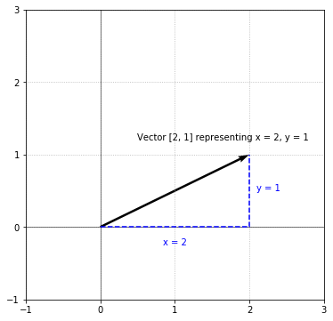
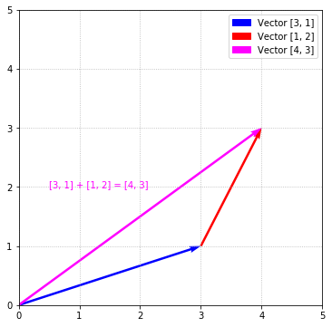
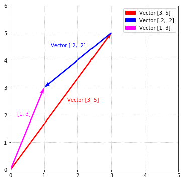

## Introduction

Hi there! Welcome to the guide on vectors!

Vectors are a very important concept in linear algebra and serve as a fundamental primitive. They are used in various ways throughout linear algebra, calculus, physics, and many other domains. As a result, introducing vectors serves as a logical starting point in our exploration of linear algebra.

What are vectors? **Vectors are simply a list of numbers that have some meaning**. For example, in physics, velocity can be represented as a vector. In chemistry, the number of molecules composing a compound can be expressed as a vector. In sociology, the results of a survey can be expressed as a vector. Let's see an example of a vector consisting of 2 elements:

$$\begin{bmatrix}5 \\ 2\end{bmatrix}$$

Since a vector is just a list of numbers, it can contain any number of elements. More generally, we can express a vector with $i$ numbers as:

$$\begin{bmatrix}v_1 \\ v_2 \\ \vdots \\ v_i\end{bmatrix}$$

Where $v_1, v_2, \dots v_i$ are real numbers. Vectors (and matrices as we'll see later) are represented as a list of numbers surrounded by square brackets, and each number in the vector is commonly called a **component** or **element**.

When it comes to thinking about vectors, we can reason about them in a couple of different ways: one, we can imagine a vector as being a point in space. From this perspective, we allow the components of the vector to make up the "axes" of the point. Second, we can think of a vector as something with a length and direction. Think of it as an arrow of sorts with a certain length and pointing off in some direction. Don't worry if this doesn't make sense—both will be covered below.

## Vectors as a point in space

A common way to reason about a vector is by viewing it as a point in space. In this way, we allow the components of the vector to make up the dimensions of the point. For example, given the the following vector:

$$\begin{bmatrix}2 \\ 1\end{bmatrix}$$

We can say this is a 2-dimensional vector, with $x = 2$ and $y = 1$. Similarly, we can have a 3-dimensional vector:

$$\begin{bmatrix}4 \\ 1 \\\ -2\end{bmatrix}$$

With $x = 4$, $y = 1$, and $z = -1$.

A benefit of this thinking is that it allows us to visualize vector by viewing them geometrically and plotting them in a coordinate system. For example, let's take the vector from above and visualize it:

$$\begin{bmatrix}2 \\ 1\end{bmatrix}$$

Since the vector above has 2 components, we can visualize it in the X-Y plane by allowing the first component, `2`, to be the X-coordinate and the second component, `1`, to be the Y-coordinate:





Vectors are drawn as arrows with a starting point and an ending point. The black arrow above is the vector $\begin{bmatrix}2 \\\ 1\end{bmatrix}$ with a starting point at the origin $(0, 0)$. Since $x = 2, y = 1$, we move 2 units in the positive X-direction and 1 unit in the positive Y-direction to arrive at the endpoint. Vectors are generally drawn as an arrow to differentiate them from a line segment.

Vectors are not limited to just 2 components. This same process scales to vectors with any number of components. For example, here is a vector with 3 components:

$$\begin{bmatrix}1 \\ 2 \\ 3\end{bmatrix}$$

This represents a vector in 3D. Geometrically, we allow $x = 1, y = 2, z = 3$. In order to visualize this vector, we need a 3D coordinate system:

<span style="display: none">(outputs/Vectors_attach_4_image.png)</span>

<figcaption style="display: block; text-align:center;">(<a href="https://www.geogebra.org/3d/nhytbgup">image source</a>)</figcaption>

In order to visualize this vector, we move 1 unit in X-direction (red axis), 2 units in the Y-direction (green axis), and 3 in the Z-direction (blue axis). Note, the light blue box in the plot above is just a visualization aid.

Beyond 3 components, it becomes difficult (or impossible) to visualize, but the vectors are still completely valid. For example:

$$\begin{bmatrix}1 \\ 0 \\ 2 \\ 1 \\ 4\end{bmatrix}$$

This vector represents a vector in 5D. Good luck trying to visualize that.

## Magnitude and direction

Another way to reason about a vector is by viewing it as something with **magnitude** (how long it is) and **direction** (the direction it is pointing in). For example, when visualizing the following vector:

$$\begin{bmatrix}2 \\ 0\end{bmatrix}$$


We can clearly see that the vector has a length of 2 (because $x = 2$), and is pointing due east. Therefore, the magnitude of this vector is $2$ and the direction is east. It's important to note that the components of a vector are what determine the magnitude and direction. The idea behind magnitude and direction become clear when we visualize vectors with different components. For example, if we visualize the following two vectors:

$$\begin{bmatrix}2 \\ 0\end{bmatrix}, \begin{bmatrix}0 \\ 2\end{bmatrix}$$


The vectors are clearly pointing in different directions even though they have the same length. Because these vectors point in a different _direction_, they are completely different vectors. Similarly, vectors can point in the same direction, but have a different _magnitude_ (i.e., length). Consider the following 2 vectors:

$$\begin{bmatrix}2 \\ 2\end{bmatrix}, \begin{bmatrix}4 \\ 4\end{bmatrix}$$


They are pointing in the same direction, but the blue vector is twice as long as the red vector, thus the 2 vectors have different magnitudes. These are 2 different vectors.

An important thing to call out is that magnitude can be different without affecting direction and vice versa as was demonstrated above. Or, they can both be different:


These 2 vectors are pointing in different directions _and_ have different lengths.

## Representing vectors

Now that we have an idea of what a vector is, let's see how we can represent it. In algebra, we can allow a symbol to represent a value:

$$x = 5$$

In this case, $x$ represents the number $5$. Similarly, we can assign vectors to symbols. The symbol names can be whatever you want, but conventionally, symbols that represent vectors tend to have an arrow over the top of them to differentiate them from the standard algebraic variable above:

$$\vec{a} = \begin{bmatrix}3 \\ 5\end{bmatrix}$$

In some instances, you may see a vector symbol in bold:

$$\textbf{a} = \begin{bmatrix}3 \\ 5\end{bmatrix}$$

When referencing a vector, I'll stick to the arrow-based method.

Okay, now that we understand how a vector is represented with a symbol, let's see how we can represent a vector in Python. Let's code up the vector:

$$\vec{v} = \begin{bmatrix}1 \\ 2\end{bmatrix}$$


```python
v = [1, 2]
```


Fortunately, since a vector is just a list of numbers, a Python list is perfect for representing a vector. In the future, we may choose to represent the vector as a class, but for now, let's keep things simple.

## Operating on vectors

Vectors wouldn't be all that interesting if we couldn't do anything with them. Fortunately, vectors behave a lot like regular numbers in that you can use many of the same arithmetic operations we learned in grade school with vectors.

### Vector addition

One of the first operations we all learned was that of simple addition. Given 2 numbers, addition produces a new number that is the result of combining the two numbers on the left:

$$3 + 4 = 7$$

The same operation applies to vectors. The result of adding 2 vectors is another vector:

$$\begin{bmatrix}1 \\ 2\end{bmatrix} + \begin{bmatrix}3 \\ 1\end{bmatrix} = \begin{bmatrix}1 + 3 \\ 2 + 1\end{bmatrix} = \begin{bmatrix}4 \\ 3\end{bmatrix}$$

The addition of vectors is done _component wise_, that is the first component of $\begin{bmatrix}1 \\\ 2\end{bmatrix}$  (which is $1$) is added to the first component of $\begin{bmatrix}3 \\\ 1\end{bmatrix}$ (which is 3) to produce the first component of the result (which is $1 + 3 = 4$). This process is repeated for all the components. Since both operands are vectors, the result is also a vector:

$$\begin{bmatrix}4 \\ 3\end{bmatrix}$$

Just as simple addition can be visualized by using a number line, we can visualize vector addition. Following the steps from above, we arrive at a resulting vector of $\begin{bmatrix}4 \\\ 3\end{bmatrix}$. Below, the red arrow represents the vector $\begin{bmatrix}1 \\\ 2\end{bmatrix}$ and the blue arrow represents the vector $\begin{bmatrix}3 \\\ 1\end{bmatrix}$. The magenta arrow represents the vector $\begin{bmatrix}4 \\\ 3\end{bmatrix}$ which is the result of adding the the 2 vectors.


Adding 2 scalar numbers can be visualized using a number line. To add the numbers $3$ and $4$:

<span style="display: none">(outputs/Vectors_attach_20_image.png)</span>

<figcaption style="display: block; text-align:center;">(<a href="http://mathandmultimedia.com/2015/07/25/add-integers-using-the-number-line/">image source</a>)</figcaption>

We simply move $3$ units in the positive direction and then from that spot move $4$ more units in the positive direction. You can also imagine this as if we had 2 ropes of length $3$ and $4$ and we lined them up end to end, then the combined length of the 2 ropes would be $7$.

This analogy of addition is useful for understanding vector addition, because the addition of 2 vectors is conceptually the result of lining up the 2 vectors end-to-end to arrive at the result. In the above example, the vector $\begin{bmatrix}1 \\\ 2\end{bmatrix}$ is plotted starting from the origin like we did above. Next, the vector $\begin{bmatrix}3 \\\ 1\end{bmatrix}$ is plotted starting at where $\begin{bmatrix}1 \\\ 2\end{bmatrix}$ ends. In total, after lining up the 2 vectors end-to-end, you can see that we moved 4 units to the right and 3 units up which is precisely the resulting vector $\begin{bmatrix}4 \\\ 3\end{bmatrix}$.

You can imagine the resulting vector (the magenta vector above) like a route—traveling 1 unit east and 2 units north followed by traveling 3 units east and 1 unit north, you arrive at the location $\begin{bmatrix}4 \\\ 3\end{bmatrix}$. You would arrive at the same spot by simply starting from the origin and traveling to $\begin{bmatrix}4 \\\ 3\end{bmatrix}$.

### Commutability

Like simple addition, vector addition is commutative. For example:

$$\begin{bmatrix}1 \\ 2\end{bmatrix} + \begin{bmatrix}3 \\ 1\end{bmatrix} = \begin{bmatrix}3 \\ 1\end{bmatrix} + \begin{bmatrix}1 \\ 2\end{bmatrix} = \begin{bmatrix}4 \\ 3\end{bmatrix}$$

We still arrive at the same result no matter which comes first. If we plot $\begin{bmatrix}3 \\\ 1\end{bmatrix}$ first and then add $\begin{bmatrix}1 \\\ 2\end{bmatrix}$, as expected, the addition still takes us to the same resulting vector:





### Vector subtraction
Unsurprisingly, subtraction is done component wise just like addition:

$$\begin{bmatrix}3 \\ 5\end{bmatrix} - \begin{bmatrix}2 \\ 2\end{bmatrix} = \begin{bmatrix}3 - 2 \\ 5 - 2\end{bmatrix} = \begin{bmatrix}1 \\ 3\end{bmatrix}$$

Another way to view subtraction is as negative addition. An intuitive reason for why this is useful can be seen when vector subtraction is visualized. For example, the above is equivalent to:

$$\begin{bmatrix}3 \\ 5\end{bmatrix} + \begin{bmatrix}-2 \\ -2\end{bmatrix} = \begin{bmatrix}3 + (-2) \\ 5 + (-2)\end{bmatrix} = \begin{bmatrix}1 \\ 3\end{bmatrix}$$

Using the route analogy, this is equivalent to traveling 3 units to the right, 5 units up (to get to $\begin{bmatrix}3 \\\ 5\end{bmatrix}$) followed by 2 units to the left and 2 units down (equivalent to $\begin{bmatrix}-2 \\\ -2\end{bmatrix}$). Below, the red vector is $\begin{bmatrix}3 \\\ 5\end{bmatrix}$, the blue vector is $\begin{bmatrix}-2 \\\ -2\end{bmatrix}$, and the magenta vector as the result $\begin{bmatrix}1 \\\ 3\end{bmatrix}$.





### Scalar multiplication with a vector

Scalar multiplication is performed by multiplying each component in the vector by a scalar number:

$$3 * \begin{bmatrix}1 \\ 2\end{bmatrix} = \begin{bmatrix}3 * 1 \\ 3 * 2\end{bmatrix} = \begin{bmatrix}3 \\ 6\end{bmatrix}$$

Conceptually, this is the same thing as repeated addition:

$$3 * \begin{bmatrix}1 \\ 2\end{bmatrix} = \begin{bmatrix}1 \\ 2\end{bmatrix} + \begin{bmatrix}1 \\ 2\end{bmatrix} + \begin{bmatrix}1 \\ 2\end{bmatrix} = \begin{bmatrix}3 \\ 6\end{bmatrix}$$

Geometrically, this can be thought of as stretching or shrinking the vector (depending on what the scalar number is). Below, the plot on the left is the result of multiplying each component by 3 and the plot on the right is the concept of repeated addition. Using what we know about addition from above, you can visualize scalar multiplication as lining up 3 copies of the vector $\begin{bmatrix}1 \\\ 2\end{bmatrix}$ end-to-end. The key takeaway is that of the fact that the resulting vector is simply a scaled version of the original vector.


### Scalar division of a vector

You usually won't find references to scalar division in resources, because you technically _can't_ divide a vector. But, for sake of completeness, I'm including it here. Recall from arithmetic that dividing by some scalar $s$ is equivalent to multiplying by $\frac{1}{s}$. Using this idea, we can represent _scalar division_ as scalar multiplication of $\frac{1}{s}$:

$$\begin{bmatrix}2 \\ 4\end{bmatrix} \div 2 = \frac{1}{2}*\begin{bmatrix}2 \\ 4\end{bmatrix} = \begin{bmatrix}1 \\ 2\end{bmatrix}$$

### Multiplication of vectors
It would be reasonable to conclude that we can multiply 2 vectors together simply by multiplying their components. However, this is **not** the case. Vector multiplication is a more involved process that we'll talk about later. For now, we'll focus on addition, subtraction, and scalar multiplication.

### Generalization

So far, our operations have been limited to vectors that only have 2 components, but all the operations in this guide apply to vectors of arbitrary size (i.e., any number of components). For example, here is addition with vectors that have 5 components:

$$
\begin{bmatrix}1 \\ 2 \\ 0 \\ 3 \\ 4\end{bmatrix} + \begin{bmatrix}3 \\ 1 \\ 2 \\ 0 \\ 1\end{bmatrix} =
\begin{bmatrix}4 \\ 3 \\ 2 \\ 3 \\ 5\end{bmatrix}
$$

Generally, we can add vectors with $n$ components by component-wise addition:

$$
\begin{bmatrix}a_1 \\ a_2 \\ \vdots \\ a_n\end{bmatrix} + \begin{bmatrix}b_1 \\ b_2 \\ \vdots \\ b_n\end{bmatrix} = \begin{bmatrix}a_1 + b_1 \\ a_2 + b_2 \\ \vdots \\ a_n + b_n\end{bmatrix}
$$

Similarly, we can multiply a vector with $n$ components by a scalar number, $c$:

$$
c * \begin{bmatrix}v_1 \\ v_2 \\ \vdots \\ v_n\end{bmatrix} = \begin{bmatrix}c * v_1 \\ c * v_2 \\ \vdots \\ c * v_n\end{bmatrix}
$$

Unfortunately, it quickly becomes impossible to visualize vectors with an increasing number of components. However, the beautiful thing about linear algebra is that the concepts scale to vectors of any size. It's just as easy to add 2 vectors in 10-dimensions as it is 2 vectors in 2-dimensions. This neat aspect is seen all throughout the subject.

## Vectors with different number of components?

You may have noticed above that addition and subtraction were performed on vectors that have the same number of components. It's impossible to perform component-wise operations on vectors with a different number of components. For instance:

$$\begin{bmatrix}2 \\ 1\end{bmatrix} - \begin{bmatrix}1 \\ 3 \\ 5\end{bmatrix} = \enspace?$$

This operation is not allowed because $\begin{bmatrix}2 \\\ 1\end{bmatrix}$ and $\begin{bmatrix}1 \\\ 3 \\\ 5\end{bmatrix}$ have a different number of components. We'll need to take this into account when implementing these operations.

## Implementing vector operations

Let's see how we might go about implementing vector addition, subtraction, and scalar multiplication from above. First, let's define some vectors to work with:

$$\vec{a}=\begin{bmatrix}1 \\ 2\end{bmatrix}, \enspace \vec{b}=\begin{bmatrix}3 \\ 4\end{bmatrix}$$

Next, we need some boilerplate and helper methods:


```python
# Some boilerplate code
from functools import reduce

# Convert a vector into a comma-separated string (e.g., [1, 2])
def v_to_str(v):
    return '[%s]' % (', '.join(map(str, v)))
```


Next, let's define $\vec{a}$ and $\vec{b}$ in code:


```python
# Define vectors a and b
a = [1, 2]
b = [3, 4]
```


The first method we'll implement is a `size` method for getting the size of a vector (i.e., number of components):


```python
# Returns the number of components in a vector
def size(v):
    return len(v)

a_size = size(a)  # Should be 2

# Note, v_to_str is a helper method to convert a Python list into a string
print('Size of %s = %d' % (v_to_str(a), a_size))
```


    Size of [1, 2] = 2


Next, let's work on addition and subtraction:


```python
# Recall, in order to do component wise operations, the vectors need to be the same size
def check_size_compatible(v1, v2):
    if size(v1) != size(v2):
        raise ValueError('Vectors are different sizes')

# Adding 2 vectors component by component
def add(v1, v2):
    check_size_compatible(v1, v2)
    return [v[0] + v[1] for v in zip(v1, v2)]

# Subtracting 2 vectors component by component
def subtract(v1, v2):
    check_size_compatible(v1, v2)
    return [v[0] - v[1] for v in zip(v1, v2)]

a_plus_b = add(a, b)        # > [4, 6]
a_minus_b = subtract(a, b)  # > [-2, -2]

print('%s + %s = %s' % (v_to_str(a), v_to_str(b), v_to_str(a_plus_b)))
print('%s - %s = %s' % (v_to_str(a), v_to_str(b), v_to_str(a_minus_b)))
```


    [1, 2] + [3, 4] = [4, 6]
    [1, 2] - [3, 4] = [-2, -2]


Finally, scalar multiplication. Recall above that multiplication can be seen as multiplying each component by a scalar number or repeated addition, so I've included both:


```python
# Multiply a vector and a scalar number
def multiply(vector, num):
    return [num * comp for comp in vector]

# Multiply a vector and a scalar number using repeated addition (using functools.reduce)
def multiply_alt(vector, num):
    return reduce(add, [vector] * num)

scalar = 3
a_times_3 = multiply(a, scalar)  # > [3, 6]
a_times_3_repeated_addition = multiply_alt(a, scalar)  # > [3, 6]

print('%s * %s = %s' % (scalar, v_to_str(a), v_to_str(a_times_3)))
print('%s * %s = %s' % (scalar, v_to_str(a), v_to_str(a_times_3_repeated_addition)))
```


    3 * [1, 2] = [3, 6]
    3 * [1, 2] = [3, 6]


To demonstrate that these operations are not limited to vectors of size 2, here are a few examples using vectors with more components:


```python
# Operations with vectors of size 4
a4 = [1, 2, 3, 4]
b4 = [2, 0, 1, 3]

a4_plus_b4 = add(a4, b4)       # > [3, 2, 4, 7]
a4_minus_b4 = subtract(a4, b4) # > [-1, -2, -2, 1]
a4_times_3 = multiply(a4, 3)   # > [3, 6, 9, 12]

print('%s + %s = %s' % (v_to_str(a4), v_to_str(b4), v_to_str(a4_plus_b4)))
print('%s - %s = %s' % (v_to_str(a4), v_to_str(b4), v_to_str(a4_minus_b4)))
print('%s * %s = %s' % ('3', v_to_str(a4), v_to_str(a4_times_3)))
```


    [1, 2, 3, 4] + [2, 0, 1, 3] = [3, 2, 4, 7]
    [1, 2, 3, 4] - [2, 0, 1, 3] = [-1, 2, 2, 1]
    3 * [1, 2, 3, 4] = [3, 6, 9, 12]


Awesome work! We're starting to really build out a good base of vector utilities.

## Negativity

One minor thing worth mentioning is that we've been referencing and visualizing vectors that are positive and live in the first quandrant. That is more out of convenience. Vectors with negative components exist and are first-class citizens along with their non-negative brethern. For example, consider the following operation:

$$\begin{bmatrix}2 \\ 1\end{bmatrix} - \begin{bmatrix}1 \\ 3\end{bmatrix} = \begin{bmatrix}1 \\ -2\end{bmatrix}$$

The result contains a negative component, and can be visualized as:


## More than 2 vectors?

It may go without saying, but for the sake of explicitness, vector operations can be combined and applied to any number of vectors. For instance, here is an example of addition of 4 vectors:

$$
\begin{bmatrix}2 \\ 1\end{bmatrix} + \begin{bmatrix}1 \\ 2\end{bmatrix} + \begin{bmatrix}1 \\ 0\end{bmatrix} + \begin{bmatrix}3 \\ 2\end{bmatrix} = \begin{bmatrix}7 \\ 5\end{bmatrix}
$$

Similar to standard arithmetic, we can combine different operations together. When doing so, the same order of operations applies to vectors:

$$
2 * \begin{bmatrix}2 \\ 1\end{bmatrix} + 3 * \begin{bmatrix}1 \\ 2\end{bmatrix} = \begin{bmatrix}4 \\ 2\end{bmatrix} + \begin{bmatrix}3 \\ 6\end{bmatrix} = \begin{bmatrix}7 \\ 8\end{bmatrix}
$$

This combination of scalar multiplication and addition is known as a _linear combination_. The name may sound complicated, but as we'll see below, it's a pretty simple concept.

## Linear combinations

As shown, we can multiply a vector $\vec{v}$ by a scalar number $c$:

$$
\vec{v} = \begin{bmatrix}v_1 \\ v_2 \\ \dots \\ v_i\end{bmatrix}, \enspace\enspace c\vec{v} = c\begin{bmatrix}v_1 \\ v_2 \\ \dots \\ v_i\end{bmatrix} = \begin{bmatrix}cv_1 \\ cv_2 \\ \dots \\ cv_i\end{bmatrix}
$$

And, add (or subtract) two vectors $\vec{u}$ and $\vec{v}$:

$$
\vec{u} = \begin{bmatrix}u_1 \\ u_2 \\ \dots \\ u_i\end{bmatrix}, \enspace \vec{v} = \begin{bmatrix}v_1 \\ v_2 \\ \dots \\ v_i\end{bmatrix} \hspace 3em
\vec{u} + \vec{v} = \begin{bmatrix}u_1 + v_1 \\ u_2 + v_2 \\ \dots \\ u_i + v_i\end{bmatrix}
$$

We can combine these 2 operations into one step called a **linear combination**. Let's create a linear combination with the above vectors $\vec{u}$ and $\vec{v}$ and scalar numbers $c$ and $d$:

$$
\vec{u} = \begin{bmatrix}u_1 \\ u_2 \\ \dots \\ u_i\end{bmatrix}, \enspace \vec{v} = \begin{bmatrix}v_1 \\ v_2 \\ \dots \\ v_i\end{bmatrix} \hspace 3em
c\vec{u} + d\vec{v} = \begin{bmatrix}cu_1 + dv_1 \\ cu_2 + dv_2 \\ \dots \\ cu_i + dv_i\end{bmatrix}
$$

A linear combination is just the joint step of multiplying the vectors by a scalar number and then adding them together. Let's take an example by finding the linear combination of the two vectors $\vec{a}$ and $\vec{b}$ and scalars $c$ and $d$:

$$
\vec{a} = \begin{bmatrix}1 \\ 2\end{bmatrix}, \enspace \vec{b} = \begin{bmatrix}3 \\ 2\end{bmatrix}, \enspace c = 2, \enspace d = 1 \hspace 3em c\vec{a} + d\vec{b} = 2\begin{bmatrix}1 \\ 2\end{bmatrix} + 1\begin{bmatrix}3 \\ 2\end{bmatrix} = \begin{bmatrix}5 \\ 6\end{bmatrix}
$$

Changing the values of $c$ and $d$ will give us another linear combination:

$$
c = 1, \enspace d = 3 \hspace 3em c\vec{a} + d\vec{b} = 1\begin{bmatrix}1 \\ 2\end{bmatrix} + 3\begin{bmatrix}3 \\ 2\end{bmatrix} = \begin{bmatrix}10 \\ 8\end{bmatrix}
$$

If we allow $c$ and $d$ to be an arbitrary real number, we can express the linear combination of $\vec{a}$ and $\vec{b}$ as:

$$
c\vec{a} + d\vec{b} = c\begin{bmatrix}1 \\ 2\end{bmatrix} + d\begin{bmatrix}3 \\ 2\end{bmatrix} = \begin{bmatrix}c \\ 2c\end{bmatrix} + \begin{bmatrix}3d \\ 2d\end{bmatrix} = \begin{bmatrix}c + 3d \\ 2c + 2d\end{bmatrix}
$$

Choosing values for $c$ and $d$ will produce some vector that is a combination of $\vec{a}$ and $\vec{b}$.

Naturally, the concept of a linear combination scales to any number of vectors and scalars:

$$
(c_1 * \begin{bmatrix}u_1 \\ u_2 \\ \dots \\ u_i\end{bmatrix}) + (c_2 * \begin{bmatrix}v_1 \\ v_2 \\ \dots \\ u_i\end{bmatrix}) + \dots + (c_j * \begin{bmatrix}w_1 \\ w_2 \\ \dots \\ u_i\end{bmatrix})
$$

Where $c_1, c_2, \dots, c_j$ are scalar numbers. Linear combinations are super useful and used throughout linear algebra and this guide, so you should be comfortable with them. 

## Lengths of vectors

Above, I mentioned that vectors have a _magnitude_ (i.e., length), but we don't know how to find it yet. It's often useful to find "how long" a vector is and we do this by using the components of the vector. Fortunately, finding the length of a vector is as easy as using the Pythagorean theorem. This becomes evident when we visualize the following 2D vector, $\vec{v}$:

$$\vec{v} = \begin{bmatrix}1 \\ 3\end{bmatrix}$$


It's easy to see that the length of $\vec{v}$ is simply the hypotenuse of the right triangle formed with the $x$ and $y$ components of $\vec{v}$. We can use the Pythagorean theorem to find the length of $\vec{v}$ (represented as $c$ in the above visualization). We allow the $x$ leg to be $a$, and the $y$ leg to be $b$:

$$
a^2 + b^2 = c^2 \\[3pt]
1^2 + 3^2 = c^2 \\[3pt]
10 = c^2 \\[3pt]
c = length(\vec{v}) = \sqrt{10}
$$

The Pythagorean theorem can also be rewritten as:

$$c = \sqrt{a^2 + b^2}$$

Naturally, we arrive at the same result:

$$
c = \sqrt{1^2 + 2^2} \\[3pt]
c = \sqrt{10}
$$

Fortunately, the process of finding the magnitude applies to vectors of any size and located anywhere in the plane because we can always form a right angle. Formally, given a vector $\vec{v}$ of arbitrary size, we can find its magnitude using the same process:

$$
\vec{v} = \begin{bmatrix}v_1 \\ v_2 \\ \dots \\ v_i\end{bmatrix} \hspace 3em
length(\vec{v}) = \sqrt{(v_1)^2 + (v_2)^2 + \dots + (v_i)^2}
$$

It's commonplace to represent the magnitude of a vector as the vector surrounded by double bars, $\left\Vert\vec{v}\right\Vert$:

$$\vec{v} = \begin{bmatrix}1 \\ 3\end{bmatrix} \hspace 3em length(\vec{v}) = \left\Vert\vec{v}\right\Vert = \sqrt{10}$$

Understanding magnitude, let's see how we might implement the length/magnitude of a vector. To illustrate, we can use the vector $\vec{v}$ from above:

$$\vec{v} = \begin{bmatrix}1 \\ 3\end{bmatrix}$$


```python
from math import sqrt

# Find the length of a vector: magnitude = sqrt(v1^2 + v2^2 + ... + vi^2)
def magnitude(vector):
    # First, square all the components, then sum the squares and take the square root
    squares = [ comp**2 for comp in vector ]
    return sqrt(sum(squares))

v = [1, 3]
v_length = magnitude(v)   # > sqrt(5) = 3.162...

# Magnitude can work on vectors with more than 2 components
a4 = [1, 2, 3, 4]
a4_length = magnitude(a4) # > sqrt(30) = 5.477...

other = [3, 4]
other_length = magnitude(other)  # > 5

print('Magnitude of %s = %f' % (v_to_str(v), v_length))
print('Magnitude of %s = %f' % (v_to_str(a4), a4_length))
print('Magnitude of %s = %d' % (v_to_str(other), other_length))
```


    Magnitude of [1, 3] = 3.162278
    Magnitude of [1, 2, 3, 4] = 5.477226
    Magnitude of [3, 4] = 5


## Component and standard form

When we draw vectors geometrically using the components to represent axes in the coordinate system (like we've been doing), this is known as drawing a vector in **component form**. Often times, for convenience sake, vectors will be drawn starting from the origin. In this case, vectors are said to be in **standard form**. Drawing a vector in _standard form_ means the vector is drawn as a directed line segment from the origin to the point that corresponds to the vector's components.

## Positions of vectors

All of the vectors drawn above are drawn in _standard form_. This is a matter of convenience. There are no rules that require vectors to be drawn in standard form. The 2 important characteristics of vectors are that they have a certain magnitude and a certain direction. In fact, the following two vectors representing $\begin{bmatrix}1 \\\ 2\end{bmatrix}$ are identical:


These 2 vectors have the same exact direction and the same magnitude. One just happens to be in standard form (the red one) and the other "starts" from $x = 2$, $y = 2$, but they are fundamentally the same vector:

$$\begin{bmatrix}1 \\ 2\end{bmatrix}$$

## Vector dimensions

Often, when discussing vectors, you'll hear mention of the word _dimension_. **Dimension** refers to how many components are in the vector. For example, the following vector:

$$\begin{bmatrix}3 \\ 1\end{bmatrix}$$

Is 2-dimensional. You'll often see it written as saying $\begin{bmatrix}3 \\\ 1\end{bmatrix}$ is a member of $\mathbb{R}^2$. This stylized "R" represents real numbers and the exponent of 2 simply means vectors with 2 real numbers as components. Here are a few other examples and their associated dimension:

$$
\begin{bmatrix}3 \\ 1 \\ 2\end{bmatrix} \enspace\rightarrow\enspace \mathbb{R}^3 \qquad
\begin{bmatrix}1\end{bmatrix} \enspace\rightarrow\enspace \mathbb{R}^1 \qquad
\begin{bmatrix}3 \\ 1 \\ 2 \\ -2\end{bmatrix} \enspace\rightarrow\enspace \mathbb{R}^4 \qquad
\begin{bmatrix}5 \\ 0\end{bmatrix} \enspace\rightarrow\enspace \mathbb{R}^2 \qquad
\begin{bmatrix}v_1 \\ v_2 \\ \vdots \\ v_n \end{bmatrix} \enspace\rightarrow\enspace \mathbb{R}^n
$$

## Putting together all the code

Below is a listing of the code we've implemented in this guide.


```python
a = [1, 2]
b = [3, 4]

# Returns the number of components in a vector
def size(v):
    return len(v)

# Recall, in order to do component wise operations, the vectors need to be the same size
def check_size_compatible(v1, v2):
    if size(v1) != size(v2):
        raise ValueError('Vectors are different sizes')

# Adding 2 vectors component by component
def add(v1, v2):
    check_size_compatible(v1, v2)
    return [v[0] + v[1] for v in zip(v1, v2)]

# Subtracting 2 vectors component by component
def subtract(v1, v2):
    check_size_compatible(v1, v2)
    return [v[0] - v[1] for v in zip(v1, v2)]

# Multiply a vector and a number
def multiply(v1, num):
    return [num * v for v in v1]

# Multiply a vector and a number using repeated addition (using functools.reduce)
def multiply_alt(v1, num):
    return reduce(add, [v1] * num)

# Find the length of a vector using Euclidian distance
def magnitude(vector):
    squares = [ comp**2 for comp in vector ]
    return sqrt(sum(squares))


# Gets the number of components in a
a_size = size(a)

# Adds a and b
a_plus_b = add(a, b)

# Subtracts a and b
a_minus_b = subtract(a, b)

# Multiplies a by the scalar 3
a_times_3 = multiply(a, 3)

# Multiplies a by the scalar 3 using repeated addition
a_times_3_repeated_addition = multiply_alt(a, 3)

# The magnitude of the vector
a_length = magnitude(a)

print('Size of %s = %d' % (v_to_str(a), a_size))
print('%s + %s = %s' % (v_to_str(a), v_to_str(b), v_to_str(a_plus_b)))
print('%s - %s = %s' % (v_to_str(a), v_to_str(b), v_to_str(a_minus_b)))
print('%s * %s = %s' % ('3', v_to_str(a), v_to_str(a_times_3)))
print('%s * %s = %s' % ('3', v_to_str(a), v_to_str(a_times_3_repeated_addition)))
print('Magnitude of %s = %f' % (v_to_str(a), a_length))

# Operations with vectors of size 4
a4 = [1, 2, 3, 4]
b4 = [9, 8, 7, 6]

a4_plus_b4 = add(a4, b4)
a4_minus_b4 = subtract(a4, b4)
a4_times_3 = multiply(a4, 3)

print('%s + %s = %s' % (v_to_str(a4), v_to_str(b4), v_to_str(a4_plus_b4)))
print('%s - %s = %s' % (v_to_str(a4), v_to_str(b4), v_to_str(a4_minus_b4)))
print('%s * %s = %s' % ('3', v_to_str(a4), v_to_str(a4_times_3)))
```


    Size of [1, 2] = 2
    [1, 2] + [3, 4] = [4, 6]
    [1, 2] - [3, 4] = [-2, -2]
    3 * [1, 2] = [3, 6]
    3 * [1, 2] = [3, 6]
    Magnitude of [1, 2] = 2.236068
    [1, 2, 3, 4] + [9, 8, 7, 6] = [10, 10, 10, 10]
    [1, 2, 3, 4] - [9, 8, 7, 6] = [-8, -6, -4, -2]
    3 * [1, 2, 3, 4] = [3, 6, 9, 12]


## Summary, tl;dr

In this guide, we introduced the vector, which is one of the basic primitives of linear algebra. We explored what a vector is, what a vector represents, how to perform operations on vectors, and how to represent vectors.

### Vectors

Vectors are defined as a list of numbers surrounded by square brackets:

$$\vec{v} = \begin{bmatrix}v_1 \\ v_2 \\ \vdots \\ v_n\end{bmatrix}$$

Where $v_1, v_2, \dots v_n$ are called the components of the vector. Vectors are represented as a symbol with an arrow over it: $\vec{v}$.

### Magnitude and direction
Vectors have a magnitude and direction which uniquely define a vector. The magnitude corresponds to _how long_ a vector is, and the direction corresponds to _which direction_ the vector is pointing in. The magnitude is referenced as $\left\Vert\vec{v}\right\Vert$ and is calculated using the Pythagorean theorem:

$$\left\Vert\vec{v}\right\Vert = \sqrt{(v_1)^2 + (v_2)^2 + \dots + (v_i)^2}$$

### Operations
Vectors behave _similar_ to real numbers in that they can be added, subtracted, and multiplied by a scalar number. These operations are performed component wise. The result of these vector operation is another vector. For example, vector addition:

$$
\vec{v} = \begin{bmatrix}v_1 \\ v_2 \\ \ldots \\ v_n\end{bmatrix}, \vec{w} = \begin{bmatrix}w_1 \\ w_2 \\ \ldots \\ w_n\end{bmatrix}, \enspace\enspace
\vec{v} + \vec{w} = \begin{bmatrix}v_1 + w_1 \\ v_2 + w2 \\ \ldots \\ v_n + w_n\end{bmatrix}
$$

$\vec{v}$ and $\vec{w}$ must have the same number of components. Same for subtraction:

$$\vec{v} - \vec{w} = \begin{bmatrix}v_1 - w_1 \\ v_2 - w2 \\ \ldots \\ v_n - w_n\end{bmatrix}$$

Scalar multiplication by a number $c$ is done by multiplying each component by $c$:

$$
\vec{v} = \begin{bmatrix}v_1 \\ v_2 \\ \ldots \\ v_n\end{bmatrix}, \enspace\enspace c\vec{v} = \begin{bmatrix}cv_1 \\ cv_2 \\ \ldots \\ cv_n\end{bmatrix}
$$

In subsequent documents, we'll dig deeper into more core concepts and build on our knowledge of vectors.

### Geometry
A vector can be viewed geometrically as a directed line segment in space with a starting point and an ending point. When visualizing vectors geometrically, vectors are location agnostic in that as long as the magnitude and direction are the same, it doesn't matter where they are plotted in the plane.

### Linear combination
A combination of scalar multiplication and addition is a linear combination. Consider a linear combination of scalar numbers $c$ and $d$ and vectors $\vec{v}$ and $\vec{w}$:

$$
\vec{v} = \begin{bmatrix}v_1 \\ v_2 \\ \ldots \\ v_n\end{bmatrix}, \vec{w} = \begin{bmatrix}w_1 \\ w_2 \\ \ldots \\ w_n\end{bmatrix}, \enspace\enspace
c\vec{v} + d\vec{w} = \begin{bmatrix}cv_1 + dw_1 \\ cv_2 + dw_2 \\ \ldots \\ cv_n + dw_n\end{bmatrix}
$$

## What's next?

In the next guide, we'll be introduced to [matrices](matrices) which are the next logical progression after vectors. What you'll see is that matrices are very similar to vectors.

<nav class="links">
    <a href="introduction" class="prev">Introduction</a>
    <a href="matrices" class="next">Matrices</a>
</nav>
